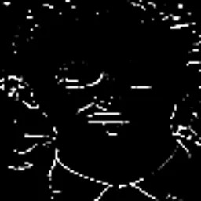

#

{height=500px}

# Le chiffrement homomorphique

## Définition générale

::: notes
Justin
:::

Le chiffrement homomorphique est une forme de cryptographie qui permet d’effectuer des opérations sur des données chiffrées, sans jamais avoir besoin de les déchiffrer.

***

::: notes
Justin
:::

Soit $m_{1}$ et $m_{2}$ deux messages clairs, $\star$ et $\circ$ deux opérations simples et $E$ un schéma de chiffrement.  
$E$ est dit homomorphe si on a :$$E(m_{1} \star m_{2}) = E(m_{1}) \circ E(m_{2})$$

## Comment ça marche ?

::: notes
Tom
:::


***

::: incremental

1. La fonction de génération de clés

2. La fonction de chiffrement

3. La fonction d'évaluation (opérations sur les données chiffrées)

4. La fonction de déchiffrement
:::

## Principes à respecter

::: notes
Tom
:::

::: incremental

1. Chiffrement sûr ou presque-sûr, besoins des systèmes d'information (confidentialité, authentification, intégrité, non-répudiation et disponibilité), principe de Kerckhoff

2. Correction (Correctness)

   ::: nonincremental
   - Le bruit introduit dans le chiffrement
   - La précision et l'encodage (cas du chiffrement de nombres réels)
   :::

   $\Rightarrow$ e.g. : **Bootstrapping**

:::

***

::: notes
Tom
:::

On distingue donc :

Homomorphisme
:   structurel (préserve les opérations)

Correction
:   fonctionnel (le résultat est bon)

Sécurité
:   l'attaquant n'apprend rien


## Classes de fonctions homomorphes

::: notes
Justin
:::

::: incremental

Deux types de fonctions homomorphes :

- Partielles ($+$ ou $\times$)

  RSA (multiplication) ou Paillier (addition)

- Complètes ($+$ et $\times$)

  Brakerski-Gentry-Vaikuntanathan (BGV)

:::

. . .

```
Cela est valide sur des entiers. Pour des flottants, les fonctions sont nécessairement homomorphiques complètes.
```

## Exemple d'une fonction homomorphe partielle : le chiffrement de Paillier

::: notes
Justin
:::

Schéma homomorphe partiel
:   permet uniquement l’addition sur des données chiffrées.

Basé sur la difficulté du logarithme discret dans les groupes multiplicatifs.

### Génération des clés

::: incremental

1. Choix de deux grands nombres premiers : $p$, $q$

2. Calcul : $n = p \times q$

3. Clé publique : $(n,g)$ avec $g \in Z_{n^{2}}$ et $g=n+1$ en général

4. Clé privée : $\lambda = PPCM(p-1,q-1)$

:::

### Chiffrement d’un message

::: incremental

1. Message $m \in [0,n]$

2. Choix d’un nombre aléatoire $r \in Z_{n}^{*}$

3. Formule de chiffrement :
   $$E(m)=g^{m} \times r^{n} \mod(n^{2})$$

:::

### Propriété homomorphe

::: incremental

- Pour deux messages chiffrés $E(m_{1})$ et $E(m_{2})$ :

  $$E(m_{1}) \times E(m_{2}) = E(m_{1} + m_{2})\mod(n^{2})$$

- Permet de faire une addition dans le domaine chiffré sans accès aux données en clair.

:::

### Déchiffrement

On définit $L(x) = \frac{x - 1}{n}$

Calcul du message déchiffré $m$ : $\left(\frac{c^{\lambda} mod(n^{2}) - 1}{n} \times \frac{1}{L(g^{\lambda} mod (n^{2})) mod(n)}\right) \mod(n)$

# Implémentation de BGV

## Propriétés

Schéma homomorphe complet
:   permet l’addition et la multiplication sur des données chiffrées.

. . .

Basé sur la difficulté du problème LWE, résistant aux attaques quantiques.

. . .

Utilise des polynômes dans des anneaux du type $\mathbb{Z}[X]/(\Phi_m(X))$ où $\Phi_m$ est un polynôme cyclotomique.

## Génération des clés

1. Choix des paramètres :
   - $n$ : degré du polynôme (puissance de 2)
   - $q$ : grand entier premier (modulo)

***

2. Clé privée $s(x)$ : polynôme aléatoire, coefficients dans $\{-1, 0, 1\}$, $deg \leq n$

***

3. Génération de la clé publique :
   - $a(x) \in R_q \text{ aléatoire}$
   - $b(x) = -a(x) \times s(x) + e(x) \mod(q)$, avec $e(x) \text{ petit bruit}$

***

```python
def keygen(q, a, s, e):
   b = mod(-a * s + e, q)
   return (a, b), s
```

## Chiffrement d’un message

::: incremental

1. Encodage du message $m(x)$ : $m'(x) = m(x) \cdot \Delta$ avec $\Delta = \lfloor \frac{q}{t} \rfloor$

2. Choix d’un bruit aléatoire $r(x)$

3. Calcul du chiffré :
   
   ::: nonincremental

   - $c_0(x) = b(x) \cdot r(x) + m'(x) \mod q$
   - $c_1(x) = a(x) \cdot r(x) \mod q$

   :::

   Le chiffré est la paire $(c_0(x), c_1(x))$

:::

***

```python
def encrypt(m, pk, delta, r, q):
   a, b = pk
   m_enc = encode(m, delta)
   c0 = mod(b * r + m_enc, q)
   c1 = mod(a * r, q)
   return (c0, c1)
```

## Encodage et décodage des messages

::: {.columns}
:::: {.column width="40%"}
```python
def encode(m, delta):
    return m * delta
```
::::
:::: {.column width="60%"}
```python
def decode(m_prime, delta, t):
    return (m_prime // delta) % q
```
::::
:::

## Propriétés homomorphes

### Addition
  
$$(c_{0},c_{1}) + (c_{0}',c_{1}') = (c_{0} + c_{0}', c_{1} + c_{1}')$$

```python
def add(c1, c2, q):
   c0 = mod(c1[0] + c2[0], q)
   c1_ = mod(c1[1] + c2[1], q)
   return (c0, c1_)
```

### Multiplication simplifiée

Multiplie deux chiffrés → donne un triplet $(c_0, c_1, c_2)$  
Il faut une étape de **relinéarisation** pour revenir à un format à deux composantes.

```python
def mul(c1, c2, s, q):
   c0 = mod(c1[0] * c2[0], q)
   c1_ = mod(c1[0] * c2[1] + c1[1] * c2[0], q)
   c2_ = mod(c1[1] * c2[1], q)
   c0p = mod(c0 + c2_ * s, q)
   c1p = c1_
   return (c0p, c1p)
```

## Déchiffrement

::: incremental

1. Calcul intermédiaire :

   $$m'(x)=c_{0}(x)+c_{1}(x) \times s(x) \mod(q)$$


2. Décodage final :

   ::: nonincremental
   :::: {.columns}

   ::::: {.column width="50%"}
   - Addition
     
     $$m(x) = \lfloor \frac{m'(x)}{\Delta} \rfloor$$

   :::::

   ::::: {.column width="50%"}
   - Multiplication
     
     $$m(x) = \lfloor \frac{m'(x)}{\Delta^{2}} \rfloor$$

   :::::
   ::::
   :::

:::

***

```python
def decrypt(ciphertext, s, q, delta, t):
    c0, c1 = ciphertext
    m_prime = mod(c0 + c1 * s, q)
    return decode(m_prime, delta, t)
```

# Reconnaissance d'image à partir de données chiffrées

::: notes
Parler de la reconnaissance d'images
:::

## Fonctionnement global

**BFV :** Proche de BGV

::: incremental

1. Chiffrement vecteurs d'embedding en local
2. Envoi au serveur
3. Recherche homomorphique possible

:::

## Principe


## Essai en direct

. . .

::: {.columns}
:::: {.column width="25%"}

::::
:::: {.column width="25%"}
1ac1a3af043d6ee86fd9fb03b934c19c490b9a0b7bd3eea952125cbcd5129296c21c9589c10f0a4f2b143fe5e60c9a8910cb96713e54ed58ef777ee7c41d376c34b4903599a555883362c5b0ba66f4dc2fc37f9e0b650def39c211cbea3f5f20241997101aba3dab16f25f73eeb428dcf3205f360427521b068f20ce89a4475715fe1c0d3794ee9522c5a77e6a34c8e14c9279b23838120b873078e42de61e292bc91d4edaf04e462eb1a7dee8dd5a2c9ed15b6d1ba8760c87f0a29afe94b8db9fe4d1fba3659a17c73a143f74315edae72885296d7c58aeef438225dc3b777c7fac3ad9456f3c04b839a4ec752c86096e8b35417285df1ef8065686f0663478a921be1e1f759de85f4e747b3530e17d262600e2871de8cc4ba5ec3d839073026cc925055b4f71a0af32fa729f7f64abce73abfa276ac99094149279dcfabcdfba2b9087c97adefbfecc897842912f2dae712fdb2f84b24c357fab664017943258ec45db03768670705a10e1b0137b3327d8a13616347793aa3c6d9d77c598c48567dbf3552f695e3c86bb67e86ea7e68d4be7115ec7b57416c8f696cfa2dea689dc3449a276417e23454b9d51352fe5ac0fe17827676f3e1ba95d4e2a8288928e5c580616b15b41536cbf78a35703a91672e740ddb38494026891179a09c786690d1b5ee78836cdd0f72c5ead834819fbabe1c0
::::
:::: {.column width="25%"}

::::
:::: {.column width="25%"}

::::
:::

# Merci de votre attention !
