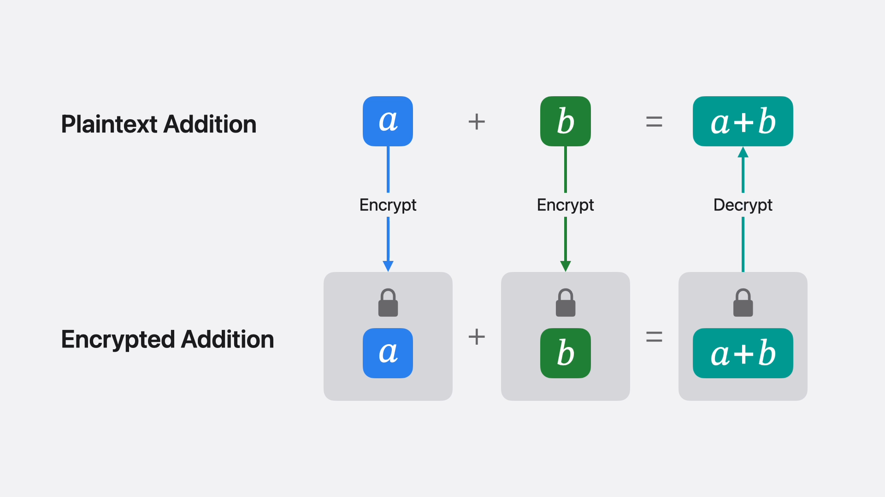
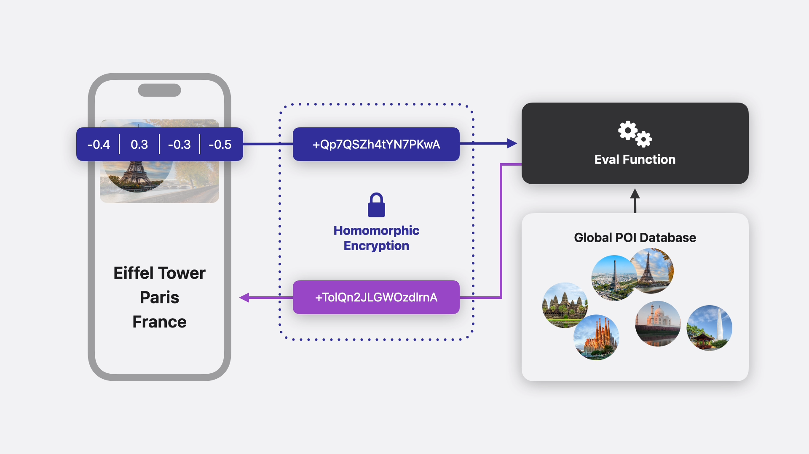

\newpage

# Le chiffrement homomorphique

\vspace{20.0px}

## Définition générale


\vspace{10.0px}

Le chiffrement homomorphique est une forme de cryptographie qui permet d’effectuer des opérations sur des données chiffrées, sans jamais avoir besoin de les déchiffrer.
    
L'avantage est qu’un serveur (ou un tiers) peut manipuler les données sans jamais voir leur contenu, ce qui est crucial pour la confidentialité. De nombreuses applications existent, notamment dans le cloud, le médical, la finance ou l'intelligence artificielle, et dans notre cas la reconnaissance d'image. Concrètement, le résultat d'une opération entre deux membres cryptés doivent donner un résultat qui, une fois décrypté, donne le résultat qu'aurait eu l'opération sur les deux membres avant l'opération de cryptage. 

\vspace{10.0px}

\begin{tcolorbox}[colback=blue!5!white,colframe=blue!75!black,title=Définition formelle]
D'une manière plus formelle, considérons deux messages clairs $m_{1}$ et $m_{2}$ et $\star$ une opération simple telle que l'addition ou la multiplication. Un schéma de chiffrement E est dit homomorphe si, pour ces deux messages $m_1$ et $m_2$, et l'opération $\star$, on a :

$$E(m_1) \star E(m_2)=E(m_1 \circ m_2)$$

soit l'opération entre le crypté de $m_1$ et le crypté de $m_2$ donne un résultat qui correspond au crypté d'une opération entre $m_1$ et $m_2$.

\vspace{1em}

Pour un tiers qui effectue le calcul, aucune information n'a fuitée : néanmoins, des opérations ont été réalisées sur les nombres. On peut donc déléguer le calcul sans crainte de fuites de données.
\end{tcolorbox}


\vspace{10.0px}

Nous allons dans la suite nous pencher plus précisément sur le fonctionnement du chiffrement homomorphe et les étapes clés qu'il implique d'un point de vue général. En effet, pour que le chiffrement homomorphe fonctionne, plusieurs fonctions clés doivent être utilisées. Ces fonctions permettent respectivement de générer des clés, de chiffrer des données, de réaliser des calculs sur ces données, et de les déchiffrer une fois les opérations terminées.

\vspace{20.0px}

### Principe de fonctionnement

\vspace{10.0px}

Tout type de chiffrement homomorphe implique ces 4 étapes clés. Il est tout de même bon de noter que c'est seulement la base indéfectible de ce qui constitue le chiffrement homomorphe et que d'autres étapes peuvent être engagées suivant les différents types de chiffrement homomorphes que nous aborderons par la suite.

Voici ces étapes :

\vspace{15.0px}

1. En premier lieu, **la fonction de génération des clés**

   \vspace{10.0px}

   C'est la première étape d'un système de chiffrement homomorphe. Elle génère deux types de clés :

   - Clé publique
     :   utilisée pour chiffrer les données.
   - Clé privée
     :   utilisée pour déchiffrer les données.

   \vspace{10.0px}

   Les clés sont générées à partir de paramètres cryptographiques tels que des grands nombres premiers, et elles permettent de garantir que seules les personnes possédant la clé privée peuvent déchiffrer les données. Nous ne nous attarderons pas sur cela étant donné que nous avons étudié ça en cours. 
   On peut tout de même noter que les clés publiques et privées doivent être générées avec une structure mathématique qui permettra d’effectuer certaines opérations sur les données chiffrées, on ne peut pas les choisir au hasard.  
   
   On ne rentrera pas dans ces détails dans cet exposé. Néanmoins, si on veut autoriser des additions dans le monde chiffré, comme dans le chiffrement de Paillier que nous verrons tout à l'heure, on choisit une structure qui rend cela possible — ici, un groupe de $\displaystyle \mathbb {Z}$ mod($n^{2}$).  
   
   Pour [CKKS](https://en.wikipedia.org/wiki/HEAAN) ou BGV/BFV (des chiffrements utilisés pour le machine learning que nous aborderons dans la suite), c’est encore plus complexe, car on doit pouvoir faire des multiplications, des divisions approximées, et gérer la précision. Les clés sont donc construites autour de polynômes, avec des paramètres très spécifiques (représentation des vecteurs de nombres réels ou complexes, comme des [polynômes dans un anneau modulo un cyclotomique](https://yongsoosong.github.io/files/slides/intro_to_CKKS.pdf)). 

   
   \vspace{15.0px}

2. Ensuite, **la fonction de chiffrement**

   \vspace{10.0px}
   La fonction de chiffrement prend un message en clair et le transforme en un message chiffré à l'aide de la clé publique. Le chiffrement doit être conçu de manière à préserver la sécurité du message, tout en permettant l'application d'opérations sur le message chiffré.  
   
   Les messages sont généralement représentés sous forme d'entiers, mais elles peuvent également être sous forme de vecteurs ou de flottants suivant la complexité de la fonction homomorphe mise en jeu. Le chiffrement transforme ces données en un format difficilement lisible sans la clé privée.

   Le chiffrement homomorphe encode les données de manière à ce que certaines opérations effectuées sur les chiffrés aient un équivalent direct sur les données en clair. C'est la structure même du chiffrement (et non juste la clé publique) qui rend cela possible.

   \vspace{15.0px}

3. Puis **la fonction d'évaluation (opérations sur les données chiffrées)**

   \vspace{10.0px}
  
   La fonction d'évaluation permet de réaliser des calculs ou des opérations sur les données chiffrées. Ces opérations peuvent être de différents types, selon le type de chiffrement homomorphe :
    
    
   \vspace{10.0px}

   - **Addition homomorphe** :   
  
      Ajouter deux valeurs chiffrées, ce qui donnera une nouvelle valeur chiffrée représentant la somme des messages en clair.

   - **Multiplication homomorphe** :   
   
      Multiplier deux valeurs chiffrées pour obtenir un résultat chiffré correspondant à la multiplication des messages en clair.

    \vspace{10.0px}
   Ces opérations sont réalisées sur les données chiffrées, et l'idée est de préserver la sécurité des données tout en effectuant les calculs nécessaires. Il existe différents niveaux de fonctionnalité selon les schémas (chiffrement partiellement homomorphe, totalement homomorphe, etc.) que nous allons étuier dans la prochaine slide.

   C’est ici que l’homomorphie est véritablement exploitée. Les schémas homomorphes sont construits de manière à permettre des opérations dans l’espace chiffré qui ont un sens dans l’espace en clair. C’est cette étape qui distingue un chiffrement classique d’un chiffrement homomorphe.
  
   \vspace{15.0px}
       
       
4. Et enfin **la fonction de déchiffrement**

   \vspace{10.0px}
      
   La fonction de déchiffrement permet de récupérer les messages en clair à partir des données chiffrées après qu'une opération a été effectuée. Cette fonction utilise la clé privée pour déchiffrer le résultat, et elle doit être conçue de manière à garantir que le déchiffrement donne le bon résultat des calculs réalisés sur les données chiffrées.

   Par exemple, après avoir ajouté deux messages chiffrés, la fonction de déchiffrement permet de récupérer le résultat de cette addition sur les messages en clair.

\vspace{20.0px}

Avant de passer à la suite, nous allons ouvrir une parenthèse : c'est important de noter un certain nombre de points concernant le chiffrement homomorphe.

Il est nécessaire de savoir qu'il existe plusieurs principes à respecter pour que le chiffrement homomorphe soit correct. Il ne s'agit pas uniquement de trouver ces fonctions qui correspondent et le tour est joué. En plus de respecter les conditions cryptographiques basiques (chiffrement sûr ou presque-sûr, besoins des systèmes d'information (concernant la confidentialité, l'authentification, l'intégrité, la non-répudiation et la disponibilité) et respectant le [principe de Kerchkhoff](https://fr.wikipedia.org/wiki/Principe_de_Kerckhoffs)),  le chiffrement doit remplir une condition supplémentaire, qui est la suivante.

\vspace{10.0px}


\begin{tcolorbox}[colback=green!5!white, colframe=green!75!black, title=Correction (Correctness)]
Le principe fondamental du cryptage homomorphique est la correction. Cela signifie que les opérations réalisées sur des données chiffrées doivent produire des résultats corrects lorsqu'elles sont décryptées. En d'autres termes, si on applique une opération sur des données chiffrées, le déchiffrement du résultat doit correspondre à l'opération effectuée sur les données originales.

Cela garantit que le chiffrement homomorphe fonctionne de manière fiable et qu'il n'introduit aucune erreur durant les calculs.

\vspace{1em}

Maintenant, on peut se dire que cela est naturel lorsqu'il y a homomorphie. Alors pourquoi la correction n'est pas garantie par simple homomorphie ?

Une fonction de chiffrement peut être homomorphe sur une certaine opération, mais ne pas garantir la correction dans toutes les conditions, notamment à cause de deux facteurs principaux :

\vspace{1em}

\begin{itemize}
  \item \textbf{Le bruit introduit dans le chiffrement}

  Dans la plupart des schémas de chiffrement homomorphes modernes (comme BGV que nous allons voir, BFV et CKKS), chaque opération (addition ou multiplication) augmente le bruit dans le chiffré.

  Ce bruit est une erreur introduite pour assurer la sécurité du chiffrement : tant que le bruit reste en dessous d’un certain seuil, le déchiffrement est correct ; mais si le bruit devient trop grand (après de nombreuses opérations), le déchiffrement peut échouer, même si la fonction reste homomorphe au sens formel.
    
  \vspace{1em}
  \item \textbf{La précision et l’encodage (cas du chiffrement de nombres réels)}
  
  Dans des schémas comme CKKS, qui permettent de traiter des nombres flottants (approximatifs), la correction devient approximative :

  Le résultat déchiffré est proche (mais pas toujours exactement égal) à celui qu’on aurait obtenu en clair. Cela fait partie du design de CKKS, qui tolère une erreur relative contrôlée. On parle alors de chiffrement homomorphe approché (approximate HE), ce qui signifie que la correction est bornée mais pas exacte.

\end{itemize}

\vspace{1em}

Une fonction peut ainsi être homomorphe sans être "correcte" dans tous les cas.

\vspace{1em}

Pour assurer la correction, on peut utiliser le \textbf{bootstrapping}. Qu'est-ce que c'est le bootstrapping ?

Le bootstrapping est une technique clé pour rendre le chiffrement homomorphe praticable sur des données de taille plus importante ou pendant plusieurs étapes de calcul. Comme on vient de l'aborder, les schémas de chiffrement homomorphes souffrent souvent d'une croissance exponentielle du bruit au fur et à mesure que des opérations sont effectuées. Ce bruit peut rendre les données inutilisables pour des opérations supplémentaires.

Le bootstrapping consiste à réinitialiser le bruit à un niveau acceptable, de sorte que l'on puisse continuer à effectuer des calculs sur les données chiffrées sans que le bruit ne compromette le résultat final. C'est un processus coûteux en ressources, mais il est nécessaire pour rendre les calculs sur des données chiffrées pratiquement réalisables à grande échelle.
\end{tcolorbox}


\vspace{20.0px}


Pour résumer, il faut donc ajouter une condition explicite de correction, qui garantit que le déchiffrement d’un calcul homomorphe donne bien le bon résultat (ou un résultat approché admissible), tant que certaines conditions sont respectées. 


C’est pour cela que dans les définitions formelles, on distingue :

* **Homomorphisme** : structurelle (préserve les opérations)
* **Correction** : fonctionnelle (le résultat est bon)
* **Sécurité** : l’attaquant n’apprend rien

Nous pouvons maintenant fermer cette parenthèse et nous attaquer à la suite concernant les chiffrements homomorphes partiel et complet.

***

\vspace{20.0px}

Comme nous l'avons rapidement abordé précédemment, il existe plusieurs classes parmi les fonctions d'évaluation du chiffrement homomorphe. Cette fonction doit être soigneusement choisie pour permettre des opérations sur les données chiffrées tout en assurant que le résultat soit correctement déchiffrable.

On peut ainsi distinguer deux types de chiffrements homomorphes selon les calculs pouvant être effectués : 

\vspace{10.0px}

- **Les chiffrement homomorphes partiels**, qui désignent l'ensemble des chiffrements homomorphes valides pour une seule opération (addition ou multiplication)

\vspace{10.0px}

- **Les chiffrements homomorphes complets ou chiffrements entièrement homomorphes (FHE)**, qui désignent l'ensemble des chiffrements homomorphes valides pour l'addition *et* la multiplication d'entiers

\vspace{10.0px}

Un chiffrement homomorphe complet est donc plus fort qu'un chiffrement homomorphe partiel, car la complétude d'une fonction d'évaluation implique ainsi sa partialité. Bien qu'on puisse penser qu'une multiplication d'entiers est une simple addition successive, effectuer cette méthode n'est pas viable lorsqu'il s'agit de grands nombres. En pratique ce sont donc les fonctions d'évaluation complètes qui sont utilisées dans la plupart des cas.

\vspace{10.0px}

\begin{tcolorbox}[colback=red!5!white,colframe=red!75!black]
Il est bon de noter que nous ne désignons que des entiers dans le chiffrement homomorphe partiel. Lorsque des fonctions d'évaluation sont utilisées pour du machine learning, il est impératif que celles-ci soient complètes dans un premier temps, et capables d'opérations sur des flottants dans un second temps. Nous parlerons plus tard de ce cas de figure d'opérations sur des flottants et considérerons des entiers pour la suite.
\end{tcolorbox}

\vspace{10.0px}

Pour illustrer le propos sur ces deux catégories de chiffrements homomorphes, nous allons prendre un exemple de chiffrement partiel et de chiffrement complet et montrer leur fonctionnement, en cryptant ensemble deux messages et en effectuant des opérations sur eux. 

Le chiffrement partiel que nous allons étudier en exemple est le chiffrement Paillier. Le chiffrement complet sera le chiffrement BGV (Brakerski-Gentry-Vaikuntanathan). 

\vspace{10.0px}

Considérons tout d'abord la fonction homomorphe partielle. La chiffrement que nous avons choisi ici s'appelle le chiffrement Paillier.

\vspace{20.0px}

## Le chiffrement Paillier

\vspace{10.0px}

Le chiffrement Paillier est un exemple de schéma de chiffrement homomorphe partiel qui permet uniquement d'effectuer des additions sur des nombres entiers. C'est l'un des systèmes de chiffrement homomorphe les plus populaires ; c'est un chiffrement à clé publique et basé sur la difficulté du problème du logarithme discret dans les groupes multiplicatifs.

Voici son fonctionnement :

\vspace{10.0px}

Comme les autres chiffrement homomorphes, Paillier repose sur un chiffrement à clé publique/clé privée. La clé publique permet de chiffrer les données, et la clé privée est utilisée pour les déchiffrer.
Nous allons aborder étape par étape de façon détaillée les méthodes sur lesquelles reposent ce chiffrement.

\vspace{10.0px}

### Génération des clés

\vspace{10.0px}

Pour la génération de clé, on peut choisir deux grands nombres premiers distincts $p$ et $q$.

On calcule $n=p \times q$ (le module, qui est utilisé dans le processus de chiffrement).

On calcule $\lambda = PPCM(p-1,q-1)$, où $PPCM$ est le plus petit multiple commun.

On choisit $g$ un entier dans $Z_{n^{2}}$, tel que $g$ ait un ordre dans le groupe $Z_{n}^{*}$. Cela signifie qu'il doit être un générateur du groupe multiplicatif $Z_{n}^{*}$, ou avoir des propriétés similaires. En d'autres termes, on doit avoir $g$ premier avec $n^{2}$ et $PPCM(L(g^{\lambda} mod(n^{2})),n)=1$. Choisir $g=n+1$ est généralement privilégié.

La clé publique est constituée des valeurs $(n,g)$, et la clé privée est $\lambda$, qui est utilisée pour le déchiffrement.

\vspace{10.0px}

### Chiffrement des messages

\vspace{10.0px}

Supposons que nous voulons chiffrer un message $m$ (un entier compris entre 0 et n).

On choisit un nombre aléatoire $r$ tel que $r \in Z_{n}^{*}$, c'est-à-dire $r$ doit être un entier entre $1$ et $n-1$, et $r$ doit être premier avec $n$.

On calcule ensuite le chiffrement de m avec la formule suivante :

$$E(m)=g^{m} \times r^{n} mod(n^{2})$$

Le message $m$ est donc chiffré en produisant deux composantes : $g^{m}$ et $r^{n}$.

La valeur chiffrée $E(m)$ est un entier qui représente le message de manière secrète. Cette valeur peut être envoyée à un serveur sans que celui-ci ne puisse connaître le message réel $m$.

\vspace{10.0px}

### Opérations sur les messages chiffrés (Addition)

\vspace{10.0px}

L'une des caractéristiques principales de Paillier est son additionnalité homomorphe comme nous l'avons vu. Si nous avons deux messages chiffrés, $E(m_{1})$ et $E(m_{2})$, nous pouvons effectuer une opération d'addition sur ces messages chiffrés sans jamais les déchiffrer.

Supposons que nous ayons deux messages $m_{1}$ et $m_{2}$, avec leurs versions chiffrées respectives $E(m_{1})$ et $E(m_{2})$.

La propriété homomorphe additive du chiffrement Paillier nous permet de ajouter les messages chiffrés :
   
$$E(m_{1}) \times E(m_{2}) = E(m_{1} + m_{2})mod(n^{2})$$

L'addition des deux valeurs chiffrées donne une nouvelle valeur chiffrée qui représente la somme des deux messages en clair. Ce résultat peut ensuite être déchiffré pour obtenir la somme réelle $m_{1} + m_{2}$.

\vspace{10.0px}

### Déchiffrement du message

\vspace{10.0px}

Pour déchiffrer un message $c$ chiffré, on utilise la clé privée. L'étape de déchiffrement fonctionne de la manière suivante :

- Soit $L(x) = \frac{x-1}{n}$, on calcule :

  $$L(c^{\lambda} mod(n^{2}) = \frac{c^{\lambda} mod(n^{2}) - 1}{n}$$

- On effectue un calcul similaire avec le générateur g, connu publiquement :

  $$L(g^{\lambda} mod(n^{2}) = \frac{g^{\lambda} mod(n^{2}) - 1}{n}$$

  Puis on calcule son inverse modulo n :

  $$\mu = \frac{1}{L(g^{\lambda} mod (n^{2})) mod(n)}$$

- Le message clair m est obtenu en multipliant les deux résultats précédents modulo n :

  $$m = (L(c^{\lambda} mod(n^{2})) \times \mu) mod (n)$$

  Soit la formule finale générale :

  $$m = \left(\frac{c^{\lambda} mod(n^{2}) - 1}{n} \times \frac{1}{L(g^{\lambda} mod (n^{2})) mod(n)}\right) mod(n)$$

Cela permet d'extraire le message $m = m_{1} + m_{2}$ en clair à partir de la version chiffrée $c$.

\vspace{10.0px}

### Exemple concret avec Paillier

\vspace{10.0px}

Prenons maintenant un exemple simple pour illustrer le processus de chiffrement et d'addition avec Paillier. Un code `Python` est donnée en annexe et reprend les étapes pour effectuer le calcul de façon numérique, de la même manière que cette section dans laquelle les calculs sont effectués "à la main".

\vspace{10.0px}

#### Génération des clés
\vspace{10.0px}

- On choisit $p=7$ et $q=11$ (exemple simple).

- On calcule $n=p \times q = 7 \times 11=77$.

- On calcule $\lambda=PPCM(7-1,11-1)=PPCM(6,10)=30$.

- On choisit $g=78 = n+1$ comme générateur de façon arbitraire (il correspond car premier avec $n^{2} = 77^{2}$ et $PPCM(L(g^{\lambda} mod(n^2)),n)=1$. 

\vspace{10.0px}

#### Chiffrement du message

\vspace{10.0px}

- On chiffre $m_{1}=3$ avec un $r=5$ (choisi aléatoirement) :

  $$E(3) = 78^{3} \times 5^{77} mod(77^{2}) = 2390$$

- On chiffre $m_{2}=5$ avec un $r'=8$ :

  $$E(5)=78^{5} \times 8^{77} mod(77^{2}) = 1366$$

\vspace{10.0px}

#### Addition des messages chiffrés

\vspace{10.0px}

On additionne les deux valeurs chiffrées :

$$E(3) + E(5) = E(3 + 5) = E(8)$$

Or, avec notre opération $\star$ :

$$E(3) \star E(5) = E(3) \times E(5) ~ mod(n^{2}) = 2390 \times 1366 ~ mod(77^{2}) = 3790 = c$$

Donc $E(8) = c = 3790$.

\vspace{10.0px}

#### Déchiffrement du message:

\vspace{10.0px}

Calculs intermédiaires : 

- $c^{\lambda}$ mod($n^{2}$) = $3790^{30}$ mod($77^2$) = 694

- L($c^{\lambda}$) = 77694-1 ​= 9

- $g^{\lambda}$ mod($n^{2}$) = 2311

- L($g^{\lambda}$) = 772311-1 ​= 30

- Inverse modulaire de 30 mod(77) = 18

    **D'où :**

\vspace{10.0px}

\begin{tcolorbox}[colback=white!5!white, colframe=black!75!black]
\[
m = L(c^\lambda) \cdot \frac{1}{L(g^\lambda)} \mod n = 9 \cdot 18 \mod 77 = 8 = 5 + 3.
\]
\end{tcolorbox}

\vspace{10.0px}

On obtient bien le résultat attendu : l'addition est valide dans le domaine chiffré. 


\vspace{20.0px}

## Le chiffrement BGV

\vspace{10.0px}

Passons maintenant à un exemple de fonction homomorphique complète : le chiffrement BGV.
  

Étant un chiffrement complet, BGV permet non seulement des additions, mais aussi des multiplications sur les données chiffrées, comme nous l'avons vu tout à l'heure.  

Il repose sur la difficulté d’un problème mathématique moderne appelé [Learning With Errors (LWE)](https://en.wikipedia.org/wiki/Learning_with_errors) ou sa version à structure algébrique [Ring-LWE](https://en.wikipedia.org/wiki/Ring_learning_with_errors). 
Sans rentrer davantage dans les détails, il fonctionne sur des [polynômes cyclotomiques](https://fr.wikipedia.org/wiki/Polyn%C3%B4me_cyclotomique) dans des anneaux de la forme : 

$${\displaystyle \mathbb {Z} [X]/(\Phi _{m}(X))}$$

LWE constitue un problème calculatoire supposé difficile et resistant aux attaques quantiques.

Nous allons aborder dans la sous-section qui suit les grandes étapes de son fonctionnement.

\vspace{20.0px}

### Génération des clés

\vspace{10.0px}

On fixe des paramètres :

- **n :** degré du polynôme (doit être une puissance de 2 pour l'efficacité).
- **q :** un grand entier premier (modulo). Il faut qu'il soit grand^[Pour une sécurité classique de 128 bits, les implémentations modernes recommandent pour BGV $q \approx 2^{50}$ à  $2^{200}$, selon la profondeur des circuits], sinon on a des débordements et le résultat final est biaisé.
- **f(x) :** un [polynôme cyclotomique](https://fr.wikipedia.org/wiki/Polyn%C3%B4me_cyclotomique), généralement de la forme $f : x \mapsto x^n + 1$.

\vspace{10.0px}

Et on choisit :

-  Une clé secrète s(x) $\in \mathbb {Z} _{q}$​, petit polynôme aléatoire^[de degré $\leq n$ et de coefficients petits, généralement dans {-1;0;1}. On veut en effet garder le produit $s \times r$ peu bruyant].

- Une clé publique $pk=(a(x),b(x))$ constituée de $a(x)\in R_{q}$ (aléatoire) et :

$$b(x) = -a(x) \times s(x) + e(x) mod(q)$$

  où $e(x)$ est un petit bruit (petit $\Leftrightarrow |e(x) \times r(x)| \leq \Delta$).
  
\vspace{10.0px}

La clé publique est donc : $pk=(a(x),b(x))$, et la clé secrète est $s(x)$.

\vspace{10.0px}

### Encodage et chiffrement

\vspace{20.0px}

Pour chiffrer un message $m(x) \in R_{q}$ (avec petits coefficients) :

- On commence par encoder $m$ avec un facteur d’échelle $\Delta = \lfloor \frac{q}{t} \rfloor$ tel qu'on ait $m'(x)=m(x) \times \Delta$. L’objectif est que $m' \gg e \times r$, pour assurer que le bruit ne perturbe pas le message lors du déchiffrement.

- On prend un petit vecteur aléatoire $r(x) \in R_{q}$

- On calcule :

  $$c_{0}(x) = b(x) \times r(x) + m'(x) ~ mod(q)$$

  et :

  $$c_{1}(x) = a(x) \times r(x) ~ mod(q)$$

\vspace{10.0px}
  
  Le chiffré est donc :

  $$c(x)=(c_{0}(x),c_{1}(x))$$
  
\vspace{10.0px}

  
### Calculs sur les messages chiffrés

\vspace{10.0px}

#### Additions

\vspace{10.0px}

L'addition s'effectue comme suit: 


$$(c_{0},c_{1}) + (c_{0}',c_{1}') = (c_{0} + c_{0}', c_{1} + c_{1}')$$

\vspace{10.0px}

#### Multiplications

\vspace{10.0px}

Le produit nécessite une étape supplémentaire - appelée *relinearization* - car le degré du chiffré augmente. La relinéarisation utilise des clés de relinéarisation, générées à partir de la clé secrète, pour ramener le chiffré à deux composantes tout en préservant l’homomorphisme. Le schéma BGV applique un traitement pour revenir à une forme standard à 2 composantes.

Concrètement, quand on multiplie deux chiffrés $c^{(1)}=(c_{0}^{(1)},c_{1}^{(1)})$ et $c^{(2)}=(c_{0}^{(2)},c_{1}^{(2)})$, on obtient :

$$c^{(1)} \times c^{(2)} = (c_{0}^{(1)} \times c_{0}^{(2)},  c_{0}^{(1)} \times c_{1}^{(2)} + c_{1}^{(1)} \times c_{0} ^ {(2)}, c_{1}^{(1)} \times c_{1}^{(2)})$$

\vspace{10.0px}

- C’est un triplet, donc on sort du format à 2 composantes.
- Il faut "relinéariser" pour revenir à un format à deux composantes.

\vspace{10.0px}

### Déchiffrement

\vspace{10.0px}

- Le détenteur de la clé privée peut supprimer le bruit et extraire le message clair à partir du polynôme :

Si $c(x)=(c0,c1)$, alors le message clair est obtenu par :

$$m'(x)=c_{0}(x)+c_{1}(x) \times s(x) ~ mod(q)$$

$$m(x) = \lfloor \frac{m'(x)}{\Delta} \rfloor$$

Sous réserve que le bruit ne soit pas trop grand, ce message est exact.

\vspace{10.0px}


\begin{tcolorbox}[colback=yellow!5!white, colframe=yellow!80!black, title=Remarque]
Le bruit augmente à chaque opération homomorphe, surtout les multiplications.  
Le schéma BGV inclut donc des techniques comme le \textit{modulus switching} pour maintenir le bruit dans des bornes correctes tout au long du calcul.  
Nous n'aborderons pas cela ici.
\end{tcolorbox}

\vspace{10.0px}

### Application du chiffrement BGV

\vspace{10.0px}

Un code `Python` est donnée en annexe et reprend les étapes pour effectuer le calcul de façon numérique, de la même manière que cette section dans laquelle les calculs sont effectués "à la main".

\vspace{10.0px}


| Paramètre | Valeur         | Justification                                  |
| --------- | -------------- | ---------------------------------------------- |
| $t$       | 64             | Message clair : on veut 4, 5, 9, 20 $\in$  \[0, 63] |
| $q$       | 65537          | Grand modulo premier, $q > \Delta^2$           |
| $\Delta$  | $\lfloor \frac{q}{t} \rfloor = 1024$ | Facteur d’échelle, assure que $m' \gg bruit$   |
| $s$       | 1              | Clé secrète simplifiée                         |
| $a$       | 1234           | Échantillon aléatoire de $\mathbb{Z}_q$        |
| $e$       | 1              | Bruit minimal pour garantir exactitude         |
| $r$       | 1              | Aléa petit et constant pour simplicité         |

\vspace{10.0px}

#### Génération de clés

\vspace{10.0px}

On calcule :

  $b=-a*s+e=-1234*1+1=-1233 ~ mod(65537)=64304$

\vspace{10.0px}

- Clé publique : $pk=(a(x)=12345, ~ b(x)=20424)$
- Clé secrète : $s(x)=1$

\vspace{10.0px}


#### Chiffrement (on veut faire 4+5)

\vspace{10.0px}

Encodage avec $\Delta=1024$ :

$$m_{1} = 4 \Rightarrow m_{1}'=4 \times 1024 = 4096$$

$$m_{2} = 5 \Rightarrow m_{2}'=5 \times 1024 = 5120$$


Rappel : $c_{0} = b \times r + m'$, $c_{1} =a \times r$

\vspace{10.0px}

Pour $m_{1}$ :

$$c_{0}^{(1)} = 64304+4096 = 68400 ~ mod(65537) = 2863$$

$$c_{1}^{(1)} = 1234$$

Pour $m_{2}$ :

$$c_{0}^{(2)} = 64304+5120 = 69424 ~ mod(65537) = 3887$$

$$c_{1}^{(2)}=1234$$

\vspace{10.0px}


#### Addition

$$(c_{0}^{(1)}+c_{0}^{(2)}, c_{1}^{(1)}+c_{1}^{(2)})=(2863+3887, 1234+1234)=(6750, 2468)$$

Déchiffrement :

$$m'^{+}=c_{0}+c_{1} \times s = 6750+2468 = 9218 ~ mod(65537)$$

$$m=\lfloor 9218/1024 \rfloor= \lfloor 9.002 \rfloor=9$$

\vspace{10.0px}

#### Multiplication

\vspace{10.0px}

Produit brut (avant relinéarisation) :

  - Formule du produit:
      
    $$c_{0}^{\times} = c_{0}^{(1)} \times c_{0}^{(2)} = 2863 \times 3887 = 11128481 ~ mod(65537) = 52728$$

    $$c_{1}^{\times} = c_{0}^{(1)} \times c_{1}^{(2)} +c_{1}^{(1)} \times c_{0}^{(2)} = 2863 \times 1234 + 1234 \times 3887 = 3532942 + 4796558 = 8329500 ~ mod(65537) = 6301$$

    $$c_{2}^{\times} = c_{1}^{(1)} \times c_{1}^{(2)} = 1234 \times 1234 = 1522756 ~ mod(65537) = 15405$$

  - Triplet :

    $$(c_{0},c_{1},c_{2})=(52728, 6301, 15405)$$

  Relinéarisation (simplifiée ici) :

  On simule que $c_{2} \times s$ est injecté dans $c_{0}$, on a :

  $$c_{0}'=c_{0}+c_{2} \times s = 52728+15405 = 68133 ~ mod(65537) = 2596$$

  $$c_{1}'= c_{1} = 6301$$

\vspace{10.0px}

#### Déchiffrement final

\vspace{10.0px}

$$m'^{\times} = c_{0}'+c_{1}'*s = 2596+6301=8897 mod(65537) = 8897$$

On obtient :

\vspace{10.0px}

\begin{tcolorbox}[colback=white!5!white, colframe=black!75!black]
\[
m=\lfloor m' \times \Delta ^{2} \rfloor = \lfloor 8897/1024^{2}\rfloor=0.
\]
\end{tcolorbox}

\vspace{10.0px}

**$\rightarrow$ Ça ne marche pas.... Pourquoi ? :(**

\vspace{10.0px}

Toute l'information a été perdue dans la réduction modulo q car le produit chiffré a dépassé q. Il faut $$m_{1} \times m_{2} \times \Delta ^{2} \ll q$$ 

Trouver un q minimal, c'est le [**noise budget**](https://hal-lirmm.ccsd.cnrs.fr/lirmm-04497864v1/file/main.pdf) (ici on n'aborde pas ça).

\vspace{10.0px}

Or ici, $m_{1}' \times m_{2}'=4096 \times 5120=20971520$ plus grand que 65537 donc le résultat est biaisé.

\vspace{10.0px}

En refaisant avec $q = 2^{36} = 68719476736$ :

$$b = -a \times s+e = -1234 \times 1+1 = -1233 ~ mod(68719476736) = 68719475503$$

\vspace{10.0px}
On reprend des paramètres : 


- Clé publique : $pk=(a(x)=12345, ~ b(x)=68719475503)$
- Clé secrète : $s(x)=1$

> Rappel : $c_{0}=b \times r+m'$, $c_{1}=a \times r$

\vspace{10.0px}

Pour $m_{1}$ :

$$c_{0}^{(1)} = 68719475503+4096 = 68719479599 ~ mod(68719476736) = 2863$$

$$c_{1}^{(1)} = 1234$$

Pour $m_{2}$ :

$$c_{0}^{(2)} = 68719475503+5120 = 68719480623 ~ mod(68719476736) = 3887$$

$$c_{1}^{(2)}=1234$$

\vspace{10.0px}

Et la multiplication :

Produit brut (avant relinéarisation) :

- Formule du produit:

  $$c_{0}^{\times} = c_{0}^{(1)} \times c_{0}^{(2)} = 2863 \times 3887 = 11128481 ~ mod(68719476736) = 11128481$$

  $$c_{1}^{\times} = c_{0}^{(1)} \times c_{1}^{(2)}+c_{1}^{(1)} \times c_{0}^{(2)} = 2863 \times 1234 + 1234 \times 3887 = 3532942 + 4796558 = 8329500 ~ mod(68719476736) = 8329500$$

  $$c_{2}^{\times}= c_{1}^{(1)} \times c_{1}^{(2)} = 1234 \times 1234 = 1522756 ~ mod(68719476736) = 1522756$$

- Triplet :

  $$(c_{0},c_{1},c_{2})=(11128481, ~ 8329500, ~ 1522756)$$

Relinéarisation (simplifiée ici) :

On simule que $c_2 \times s$ est injecté dans $c_{0}$, on a :

$$c_{0}'=c_{0}+c_{2} \times s = 11128481+1522756 = 12651237 ~ mod(68719476736) = 12651237$$

$$c_{1}'= c_{1} = 8329500$$

Finalement :

$$m'^{\times} = c_{0}'+c_{1}' \times s = 12651237+8329500 = 20980737 ~ mod(68719476736) = 20980737$$

On utilise : 
\vspace{10.0px}


\begin{tcolorbox}[colback=white!5!white, colframe=black!75!black]
\[
m=\lfloor m' \times \Delta ^{2} \rfloor= \lfloor 20980737/1024^{2} \rfloor = 20
\]
\end{tcolorbox}

\vspace{10.0px}

On obtient maintenant bien le résultat escompté.

\vspace{20.0px}

# Reconnaissance d’image à partir de données chiffrées

\vspace{20.0px}

Dans cette section, nous allons prendre ce que nous avons précedemment défini comme base pour aborder le cas précis de la reconnaissance d'images à partir de données chiffrées homomorphiquement, en nous concentrant sur le cas pratique d'Apple.

Dans [cet article](https://hebdo.framapad.org/p/5jbeliy9oy-aeif?lang=fr), Apple explique qu'ils ont implémenté l'algorithme BFV^[Le Brakerski-Fan-Vercauteren est un version plus complexe que le BGV, bien qu'ils soient liés. Ce dernier travaille sur les bits de poids faibles, tandis que le premier est sur les bits de poids forts : <https://eprint.iacr.org/2021/204.pdf>] (Brakerski-Fan-Vercauteren) pour permettre la recherche de lieux et visages par l'utilisateur à partir de sa galerie, en utilsant du machine learning sur les données chiffrées. Apple utilise BFV pour répondre à ces exigences car il reprend une structure similaire à celle de BGV mais plus complexe et complète, la rendant plus résiliente au bruit. Elle est, comme BGV, homomorphiquement complète en permettant multiplications et additions. Nous avons déjà traité un cas simple de BGV dans ce rapport, donc nous ne développerons pas au sujet de BFV pour garder de la simplicité (et un nombre de pages relativement court). Par ailleurs, les étapes considérées pour BFV reprennent les mêmes étapes que celles de BGV (les étapes de noise management et de bootstrapping sont légerement modifiées, mais nous n'en avons pas traité en détail dans notre schéma simplifié de BGV donc nous ne développerons pas d'avantage non plus). 


\vspace{10.0px}

Par ailleurs, il est nécessaire d'effectuer plusieurs étapes avant de pouvoir chiffrer les images et effectuer des calculs pour les opérations de machine learning. Les opérations mises en oeuvres dans le domaine chiffré sont en effet bien plus lourdes que dans le domaine classique (cf section précedente où un simple $4 \times 5$ peut s'avérere être une opération délicate). Avant d'aborder ces étapes, il est nécessaire de définir un certain nombre de termes utiles à la suite. 

\vspace{10.0px}

## Définitions

\vspace{10.0px}

- **Vecteur d'embedding** : 
  Un vecteur d'embedding est une représentation mathématique dense d’un objet complexe, comme une image ou un texte, sous forme d’un vecteur de nombres réels.
  Dans le cadre de la reconnaissance d’image, un embedding encode les caractéristiques visuelles essentielles d’une image (formes, couleurs, textures) dans un espace vectoriel de dimension réduite (souvent entre 128 et 512 dimensions). Deux images similaires produiront des vecteurs proches selon une métrique définie, comme la distance euclidienne ou le produit scalaire. Ces vecteurs sont utilisés pour comparer, classer ou rechercher des images efficacement.

\vspace{10.0px}

- **Quantification (Quantization)** :
  Procédé qui consiste à convertir des valeurs réelles en entiers pour permettre leur chiffrement. Cela permet d’utiliser un chiffrement comme BFV qui ne supporte que les entiers.
  Exemple : convertir $0.812 \rightarrow 81$ si on travaille avec 2 chiffres après la virgule.

\vspace{10.0px}

- **Batching (encodage par paquets)** :
  Technique d’optimisation qui permet de chiffrer plusieurs valeurs indépendantes dans un seul chiffré grâce à des structures algébriques (comme les anneaux cyclotomiques).
  Cela permet par exemple de traiter tout un vecteur d'embedding en une seule opération homomorphe, en exploitant le parallélisme structurel du schéma ([SIMD](https://fr.wikipedia.org/wiki/Single_instruction_multiple_data) : Single Instruction, Multiple Data).


\vspace{10.0px}

## Comment fonctionne la reconnaissance d'image ?

\vspace{10.0px}

Dans un système classique, la reconnaissance d’image repose sur l’extraction d’un **vecteur d’embedding** à partir d’une image. En effet, il n'est pas envisageable d'effectuer trop de calculs, nottament dans le domaine chiffré : on cherche alors à diminuer coûte que coûte le nombre de calculs à effectuer. Afin de pouvoir faire l'embedding, on transpose les données flottantes en entiers en effectuant de la **quantification**. Sans cette étape, BFV ne convient pas et il faut envisager une méthode de chiffrement homomorphique qui gère les flottants (CKKS par exemple). On procède ensuite à l'encodage, en effectuant du **batching** pour ne pas encoder outre mesure. Ce vecteur est ensuite comparé à d'autres vecteurs contenus dans une base de données d’embeddings, représentant d'autres images, grâce à du machine learning. Cette comparaison permet d’identifier les images visuellement proches.

\vspace{10.0px}



\vspace{20.0px}

## Cas pratique : la recherche visuelle améliorée chez Apple

\vspace{10.0px}

Apple a récemment intégré le chiffrement homomorphe dans son écosystème, notamment pour les fonctionnalités de recherche d'images similaires sur appareil. 

L’objectif est, comme nous l'avons décrit précédemment, de permettre aux utilisateurs de retrouver des images visuellement proches sans jamais exposer les données personnelles (ni images, ni vecteurs d'embedding, ni requêtes). Tout se fait sous forme chiffrée, grâce à l’utilisation du schéma BFV.

Le principe est le même que pour d'autres gestionnaires de photo (google photo nottament). La galerie dispose d'une barre de recherche dans laquelle il est possible de chercher des photos par mot clé (lieu, personne, etc). Le téléphone n'est pas en mesure d'effectuer les calculs d'analyse d'image nécessaires, mais le serveur ne doit pas non plus pouvoir avoir accès aux photos en clair. C'est donc le chiffrement homomorphe qui est utilisé pour répondre à ces exigences, selon le fonctionnement global suivant.


### Fonctionnement global

\begin{itemize}
\item En local, l’iPhone extrait les vecteurs d’embedding de chaque photo. Ces vecteurs sont chiffrés via BFV et stockés dans la base chiffrée personnelle de l’utilisateur, sur les serveurs d’Apple.
\item Lors d’une recherche, un vecteur d’embedding est extrait localement à partir de la requête (image à rechercher).
\item Ce vecteur est à son tour chiffré avec la même clé (ou une clé dérivée).
\item Le vecteur chiffré est envoyé au serveur, qui effectue les comparaisons homomorphes (produits scalaires ou distances euclidiennes approximées) sur les embeddings chiffrés.
\item Le résultat des comparaisons est renvoyé, toujours chiffré, à l’iPhone qui le déchiffre localement et affiche les images les plus similaires.
\end{itemize}

\vspace{10.0px}



\vspace{10.0px}

### Pourquoi BFV ?

\vspace{10.0px}

Le choix de BFV (plutôt que BGV ou CKKS) est motivé par plusieurs raisons :

* Il permet un chiffrement exact sur des entiers, ce qui est adapté pour manipuler des embeddings discrétisés.

* Il prend en charge les additions et multiplications, nécessaires pour les calculs de produits scalaires.

* Il est plus stable numériquement que CKKS, qui introduit des erreurs d’approximation.


\vspace{10.0px}

## Perspectives et limitations

\vspace{10.0px}

L'intégration du chiffrement homomorphe dans les systèmes de reconnaissance d'image constitue une avancée majeure vers une IA respectueuse de la vie privée en permettant de déléguer des calculs complexes à des serveurs distants, sans jamais exposer les données personnelles.
\vspace{10.0px}
Cependant, plusieurs défis subsistent :

\begin{itemize}
\item Le coût computationnel reste élevé, même si des progrès matériels (accélérateurs cryptographiques) et logiciels (optimisations algébriques) réduisent cet écart.
\item Le bruit homomorphe limite la profondeur des circuits de calcul réalisables sans recours au bootstrapping.
\item Le déploiement à large échelle nécessite une gestion complexe des clés, des formats d'encodage, et des mises à jour logicielles sécurisées.
\end{itemize}

\vspace{10.0px}

\begin{tcolorbox}[colback=blue!5!white, colframe=blue!75!black, title=Conclusion]
La recherche visuelle chiffrée, comme mise en œuvre par Apple avec le chiffrement BFV, montre qu’il est possible de concilier confidentialité et puissance algorithmique.
Ce modèle pourrait s’étendre à d'autres domaines sensibles comme la santé (c'est déjà d'actualité), la biométrie ou la vidéosurveillance intelligente (c'est encore trop ambitieux, pour des raisons de puissance de calcul).
\end{tcolorbox}


\newpage


# Bibliographie

\vspace{10.0px}

## Github du projet
<https://github.com/realnitsuj/crypto-homomorphisme>

\vspace{10.0px}

## Le chiffrement homomorphique

\vspace{10.0px}

Principes généraux :

<https://youtu.be/4GFptdPqqFI?si=G74VYxiTuMGQMWKV>

<https://fr.wikipedia.org/wiki/Chiffrement_homomorphe>

<https://homomorphicencryption.org/introduction/>

<https://www.statcan.gc.ca/fr/science-donnees/reseau/chiffrement-homomorphe>

<https://www.iacr.org/news/item/22394>

\vspace{10.0px}


Principes mathématiques :

<https://www.youtube.com/@CipheredDuck>

<https://www.jeremykun.com/2024/05/04/fhe-overview/>

<https://www.daniellowengrub.com/blog/2024/01/03/fully-homomorphic-encryption>

\vspace{10.0px}

CKKS :

<https://www.youtube.com/watch?v=iQlgeL64vfo&t=745s>

\vspace{10.0px}

BFV : 

<https://crypto.stackexchange.com/questions/98204/what-is-the-difference-between-the-fully-homomorphic-bfv-and-bgv-schemes>

\vspace{10.0px}

## Reconnaissance d’image à partir de données chiffrées

\vspace{10.0px}

Écosystème Apple :

<https://machinelearning.apple.com/research/homomorphic-encryption>


\vspace{10.0px}

Autre :

<https://huggingface.co/spaces/zama-fhe/encrypted_image_filtering>

<https://github.com/zama-ai/concrete-ml?tab=readme-ov-file#demos>

\vspace{10.0px}


\newpage

# Annexes {-}

\vspace{10.0px}

## Implémentation du chiffrement de Paillier {-}

```{.python .numberLines}
import random
import math
from sympy import mod_inverse, lcm

# -----------------------
# Ce code est un code d'exemple applicatif du Chiffrement de Pailliler. Voici les paramètres qu'il considère :
# - p = 7
# - q = 11
# Ceci sont simples et ne fonctionnent que pour des additions d'entiers petits et de démonstration. On peut vérifier si l'opération est bonne et donc observer les divergences.
# -----------------------


# -----------------------
# Génération des clés
# -----------------------
def generate_keys(p, q):
    n = p * q
    nsq = n * n
    lam = int(lcm(p - 1, q - 1))  # Convertir en vrai int python
    g = n + 1  # Comme dans notre exemple, choix simple
    if math.gcd(g, nsq) != 1:
        raise ValueError("g n'est pas premier avec n^2")
    return (n, g), (lam, n)

# Fonction L définie par le schéma de Paillier
def L(u, n):
    return (u - 1) // n

# -----------------------
# Chiffrement
# -----------------------
def encrypt(m, public_key):
    n, g = public_key
    nsq = n * n
    r = random.randint(1, n - 1)
    while math.gcd(r, n) != 1:
        r = random.randint(1, n - 1)
    c = (pow(g, m, nsq) * pow(r, n, nsq)) % nsq
    print(f" Chiffrement de {m} avec r = {r}:")
    print(f"   c = (g^{m} mod n²) * (r^n mod n²) mod n²")
    print(f"   => c = {c}")
    return c

# -----------------------
# Déchiffrement
# -----------------------
def decrypt(c, private_key, public_key):
    lam, n = private_key
    g = public_key[1]
    nsq = n * n
    u = pow(c, lam, nsq)
    l_u = L(u, n)
    g_lam = pow(g, lam, nsq)
    l_g = L(g_lam, n)
    mu = mod_inverse(l_g, n)
    m = (l_u * mu) % n
    print(f" Déchiffrement:")
    print(f"   u = c^lambda mod n² = {u}")
    print(f"   L(u) = {l_u}, L(g^lambda mod n²) = {l_g}, mu = {mu}")
    print(f"   m = L(u) * mu mod n = {m}")
    return m


# -----------------------
# Addition homomorphe
# -----------------------
def homomorphic_add(c1, c2, n):
    nsq = n * n
    c_add = (c1 * c2) % nsq
    print(f" Addition homomorphe:")
    print(f"   c_add = c1 * c2 mod n² = {c_add}")
    return c_add


# -----------------------
# Main
# -----------------------
if __name__ == "__main__":
    # Petits premiers d'exemple'
    p = 7
    q = 11
    print("Génération des clés :")
    public_key, private_key = generate_keys(p, q)
    n, g = public_key
    print(f"   p = {p}, q = {q}")
    print(f"   n = {n}, g = {g}, lambda = {private_key[0]}")
    print("-" * 50)

    # Entrée utilisateur
    m1 = int(input("Entrez le message m1 (entier) : "))
    m2 = int(input("Entrez le message m2 (entier) : "))
    print("-" * 50)

    # Chiffrement
    c1 = encrypt(m1, public_key)
    print("-" * 50)
    c2 = encrypt(m2, public_key)
    print("-" * 50)

    # Addition homomorphe
    c_add = homomorphic_add(c1, c2, n)
    print("-" * 50)

    # Déchiffrement
    result = decrypt(c_add, private_key, public_key)
    print("-" * 50)

    # Comparaison avec la valeur réelle
    expected = (m1 + m2)
    print(f"Résultat attendu : {m1} + {m2} mod n = {expected}")
    print(f" Comparaison : {' Correct' if result == expected else f' Incorrect (obtenu = {result})'}")
```

## Implémentation du BGV {-}

```{.python .numberLines}
# fonction du modulo à la main
def mod(x, q):
    return x % q

# -----------------------------
# Ce code est un code d'exemple applicatif du Chiffrement BGV. Voici les paramètres qu'il considère :
# -----------------------------
t = 64                 # espace de message modulo t
q = 2**36             # grand module (sans noise budget)
delta = 1024           # facteur d'encodage (scale factor)

# Clé secrète, échantillon aléatoire, bruit et aléa (fixés ici pour simplicité, cf rapport)
s = 1
a = 1234
e = 1
r = 1
# Ceci sont simples et ne fonctionnent que pour des multiplications d'entiers relativement petits (cf rapport) et de démonstration. On peut vérifier si l'opération est bonne et donc observer les divergences. Ici, ça fonctionne jusqu'à environ 8*8.


# -----------------------------
# Génération de la clé
# -----------------------------
def keygen(q, a, s, e):
    """
    Génère la clé publique (a, b) et la clé secrète s
    selon la formule : b = -a * s + e mod q
    """
    b = mod(-a * s + e, q)
    return (a, b), s

# -----------------------------
# Encodage et décodage des messages
# -----------------------------
def encode(m, delta):
    """Encode un message m en entier modulo q via un facteur delta, ici fixe"""
    return m * delta

def decode(m_prime, delta, t):
    """
    Décodage du message chiffré m_prime.
    On divise par delta, puis modulo q pour retrouver m.
    """
    return (m_prime // delta) % q

# -----------------------------
# Chiffrement
# -----------------------------
def encrypt(m, pk, delta, r, q):
    """
    Chiffre un message m avec la clé publique pk = (a, b).
    On calcule :
        c0 = b * r + encode(m)
        c1 = a * r
    modulo q.
    """
    a, b = pk
    m_enc = encode(m, delta)
    c0 = mod(b * r + m_enc, q)
    c1 = mod(a * r, q)
    return (c0, c1)

# -----------------------------
# Déchiffrement
# -----------------------------
def decrypt(ciphertext, s, q, delta, t):
    """
    Déchiffre un "ciphertext" (c0, c1) avec la clé secrète s.
    On calcule :
        m' = c0 + c1 * s mod q
    puis on décode pour retrouver m.
    """
    c0, c1 = ciphertext
    m_prime = mod(c0 + c1 * s, q)
    return decode(m_prime, delta, t)

# -----------------------------
# Addition homomorphe
# -----------------------------
def add(c1, c2, q):
    """
    Addition homomorphe de deux "ciphertexts".
    On additionne composante par composante modulo q.
    """
    c0 = mod(c1[0] + c2[0], q)
    c1_ = mod(c1[1] + c2[1], q)
    return (c0, c1_)

# -----------------------------
# Multiplication homomorphe (simplifiée)
# -----------------------------
def mul(c1, c2, s, q):
    """
    Multiplication homomorphe simplifiée de deux ciphertexts.
    Renvoie un ciphertext de degré 1 en appliquant une relinéarisation simple (cf rapport).
    """
    c0 = mod(c1[0] * c2[0], q)
    c1_ = mod(c1[0] * c2[1] + c1[1] * c2[0], q)
    c2_ = mod(c1[1] * c2[1], q)
    # Relinearisation : on injecte c2 * s dans c0 pour réduire le degré comme dans le rapport
    c0p = mod(c0 + c2_ * s, q)
    c1p = c1_
    return (c0p, c1p)

# -----------------------------
# Programme principal
# -----------------------------
if __name__ == "__main__":
    print(f"Paramètres du système :")
    print(f" - t (modulo messages) = {t}")
    print(f" - q (module) = {q}")
    print(f" - delta (facteur d'encodage) = {delta}")
    print(f" - clé secrète s = {s}")
    print(f" - bruit e = {e}")
    print(f" - aléa r = {r}")
    print("-" * 50)

    # Génération des clés
    pk, sk = keygen(q, a, s, e)
    print(f"Clé publique : a = {pk[0]}, b = {pk[1]}")
    print(f"Clé secrète : s = {sk}")
    print("-" * 50)

    # Entrée utilisateur pour deux messages
    m1 = int(input("Entrez le message m1 (entier entre 0 et t-1) : "))
    m2 = int(input("Entrez le message m2 (entier entre 0 et t-1) : "))
    print("-" * 50)

    # Chiffrement
    ct1 = encrypt(m1, pk, delta, r, q)
    ct2 = encrypt(m2, pk, delta, r, q)
    print(f"Chiffrement m1 = {m1} : c0 = {ct1[0]}, c1 = {ct1[1]}")
    print(f"Chiffrement m2 = {m2} : c0 = {ct2[0]}, c1 = {ct2[1]}")
    print("-" * 50)

    # Addition homomorphe
    ct_add = add(ct1, ct2, q)
    result_add = decrypt(ct_add, sk, q, delta, t)
    print(f"Addition homomorphe : {m1} + {m2} mod {q} = {result_add}")
    expected_add = m1 + m2
    print(f" Comparaison : {' Correct' if result_add == expected_add else f' Incorrect (obtenu = {result_add})'}")
    print("-" * 50)

    # Multiplication homomorphe
    # Attention, on multiplie les facteurs d'encodage delta donc il faut diviser par delta^2
    ct_mul = mul(ct1, ct2, sk, q)
    result_mul = decrypt(ct_mul, sk, q, delta * delta, t)
    print(f"Multiplication homomorphe : {m1} * {m2} mod {q} = {result_mul}")
    expected_mul = m1 * m2
    print(f" Comparaison : {' Correct' if result_mul == expected_mul else f' Incorrect (obtenu = {result_mul})'}")
```
